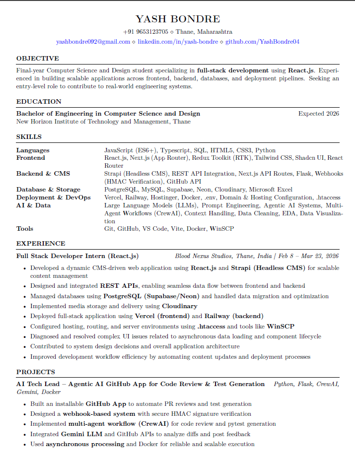

# Hi there, I'm Yash Bondre 👋

<h3 align="left">
  
  Full-Stack Developer | AI & Browser Systems Enthusiast | Data Analytics
</h3>

I specialize in building scalable web applications and advanced browser-native systems. I love combining modern frontend frameworks like React and Next.js with robust backend architectures and powe[...]

<h3 align="left">
  
  About Me
</h3>

- 🎓 **Education:** Bachelor’s degree in Computer Science & Design from New Horizon Institute of Technology and Management.
- 💼 **Experience:** Recently worked as a **Full Stack Developer Intern** at Blood Nexus Studios, building a scalable CMS-driven web application with React.js, Strapi, and PostgreSQL.
- 🔭 **Currently Building:** **SnapFlow**, an advanced Chrome extension that captures live webpages as editable documents with powerful export, annotation, and document workflow features.
- 🌱 **Learning & Exploring:** Browser internals, advanced Chrome extension architecture, AI workflows, and scalable full-stack systems.
- 📫 **How to reach me:** [yashbondre092@gmail.com](mailto:yashbondre092@gmail.com)

---

<h3 align="left">
  
  Tech Stack & Tools
</h3>

**Frontend:**
 

**Backend & Databases:**
 

**DevOps, Tools & AI:**
 

---

<h3 align="left">
  
  Featured Projects
</h3>

- **[AI Tech Lead – Agentic AI GitHub App](https://github.com/YashBondre04):** Built an installable GitHub App using Python, Flask, CrewAI, and Gemini to automate pull request reviews and Pytest[...]

- **[Revolver Rift Website](https://revolverrift.com):** Developed and maintained a modern production-ready web platform with responsive UI, scalable frontend architecture, and optimized user expe[...]

- **[SnapFlow](https://github.com/YashBondre04):** An advanced Chrome extension that captures live webpages using DOM-based rendering instead of screenshots, enabling editable exports, annotations[...]

- **[Ledgerly SaaS Platform](https://ledgerly-chi.vercel.app/):** A modern B2B/B2C SaaS tool marketing website showcasing responsive web design and seamless user experience.

---

<h3 align="left">
  
  Resume Preview
</h3>

> 📥 **[Download PDF Resume](./Yash_Bondre_April_2026.pdf)**

---

<h3 align="left">
  
  Let's Connect!
</h3>

 

